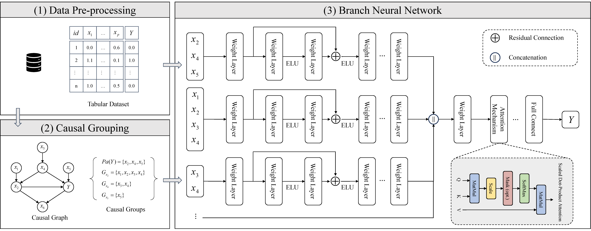

# BNN-CC

This is the official implementation of the paper **"[BNN-CC]()"**

## Overview

In this paper, we propose a novel framework called BNN-CC. The figure below illustrates the overall framework of our BNN-CC.



## Project directory structure

<!-- get a tree directory structure

## Step1
PowerShell (PS): tree /f > tree.txt

## Step2
Put the following code into the URL (https://devtool.tech/tree) for rendering
```sh
+ BNNCC-codes
  + data
    + ihdp
      + ihdp_npci_1-1000.train.npz.zip
      + ihdp_npci_1-1000.test.npz.zip
  + models
    + bnncc_regression.py
    + bnncc_classification.py
  + data_loader.py
  + utils.py
  + causal_discovery.py
  + main_IHDP.py
  + requirements.txt
  + README.md
``` -->

```sh
BNNCC-codes
├── data
│   └── ihdp
│       ├── ihdp_npci_1-1000.train.npz.zip
│       └── ihdp_npci_1-1000.test.npz.zip
├── models
│   └── bnncc_regression.py
├── data_loader.py
├── utils.py
├── causal_discovery.py
├── main_IHDP.py
├── requirements.txt
└── README.md
```

## How to Run

- Installation: environment and dependences.
```sh
## Set up a new conda environment with Python 3.8.19
conda create -n BNNCC python=3.8.19
conda activate BNNCC

## Install python libraries or dependences.
# pip install gcastle==1.0.3 torch==2.1.0 graphviz==0.20.3 configargparse==1.7 jupyter==1.1.1 lazypredict==0.2.13 tensorflow==2.13.1
pip install -r requirements.txt
```


- Evaluation: quick start

```sh
python main_IHDP.py  # Experiments on the IHDP dataset
```

## Acknowledgements

We would like to express our sincere gratitude to the related works and open-source codes that have served as inspiration for our project:

- Gcastle package. [[github](https://github.com/huawei-noah/trustworthyAI/tree/master/gcastle)]

- Lazypredict package. [[github](https://github.com/shankarpandala/lazypredict)]