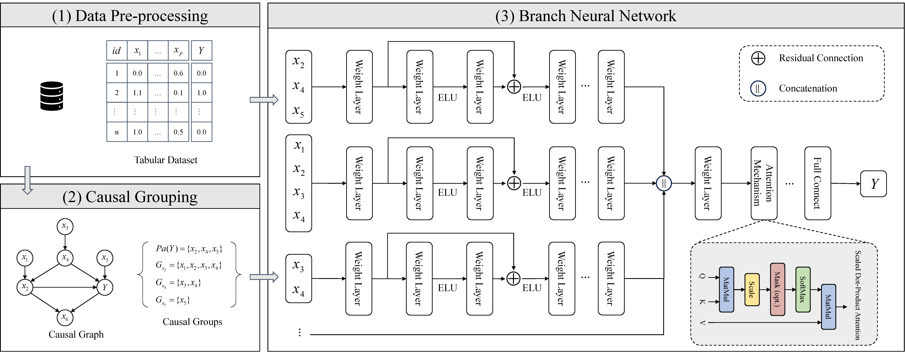

# 🌈 BNN-CC

This is the implementation of the paper "[Causal structure-enhanced branch neural networks for interpretable and robust regression](https://doi.org/10.1016/j.eswa.2026.131851)", published at Expert Systems With Applications (ESWA) in 2026.

## 📋 Overview

In this paper, we propose a novel framework called BNN-CC. The figure below illustrates the overall framework of our BNN-CC.



## 📁 Project directory structure

```sh
BNNCC-codes/
├── README.md
├── requirements.txt
├── LICENSE.txt
├── main_IHDP.py
├── utils.py
├── causal_discovery.py
├── data_loader.py
├── models/
│   └── bnncc_regression.py
└── data/
    ├── ihdp/
    │   ├── variables_description_IHDP_EN.csv
    │   ├── train_df.csv
    │   └── test_df.csv
    └── twins/
        ├── variables_description_twins_EN.csv
        └── data_twins.csv
```

## 🚀 How to Run

- Installation: environment and dependences.
```sh
## Set up a new conda environment with Python 3.8.19
conda create -n BNNCC python=3.8.19
conda activate BNNCC

## Install python libraries or dependences.
# pip install gcastle==1.0.3 torch==2.1.0 graphviz==0.20.3 configargparse==1.7 jupyter==1.1.1 lazypredict==0.2.13 tensorflow==2.13.1
pip install -r requirements.txt
```


- Evaluation: quick start

```sh
python main_IHDP.py  # Experiments on the IHDP dataset
```

## 📚 Citation
Please cite our work if you found the resources in this repository useful:

```
@article{cai2026causal,
  title={Causal Structure-Enhanced Branch Neural Networks for Interpretable and Robust Regression},
  author={Cai, Jiangqian and Qian, Quan},
  journal={Expert Systems with Applications},
  pages={131851},
  year={2026},
  publisher={Elsevier}
}
```

## 🥰 Acknowledgements

We would like to express our sincere gratitude to the related works and open-source codes that have served as inspiration for our project:

- Gcastle package. [[github](https://github.com/huawei-noah/trustworthyAI/tree/master/gcastle)]

- NNSIP package. [[github](https://github.com/RogerG2/NNSIP)]

- Lazypredict package. [[github](https://github.com/shankarpandala/lazypredict)]